# TrailVerse — Page Architecture & Flow Diagrams

**Product:** [nationalparksexplorerusa.com](https://www.nationalparksexplorerusa.com)  
**Stack:** Next.js 16 App Router (Vercel) · Express API (Render) · MongoDB · NPS API · OpenAI/Anthropic  
**Scope:** Explore · Park Detail · Trailie (`/plan-ai`) · Events · Compare · Discover  

This document maps how each major surface is wired: routes, components, APIs, SSR vs client fetching, and primary user flows.

---

## Table of contents

1. [Platform overview](#1-platform-overview)
2. [Explore (`/explore`)](#2-explore-explore)
3. [Park detail (`/parks/[slug]`)](#3-park-detail-parksslug)
4. [Trailie (`/plan-ai`)](#4-trailie-plan-ai)
5. [Events (`/events`)](#5-events-events)
6. [Compare (`/compare`)](#6-compare-compare)
7. [Discover (`/discover`)](#7-discover-discover)
8. [Cross-page patterns](#8-cross-page-patterns)

---

## 1. Platform overview

### 1.1 System context

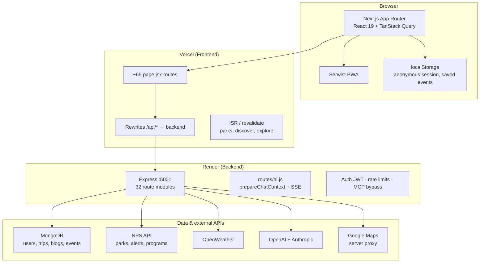

### 1.2 Request path (all pages)

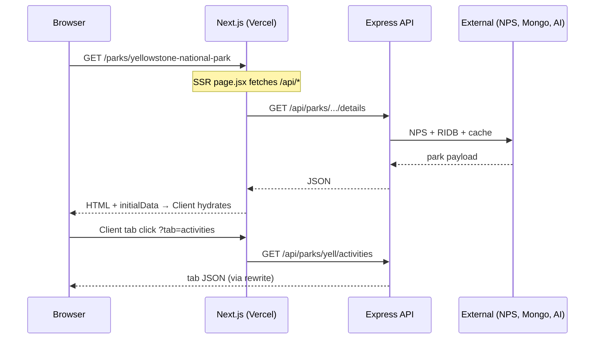

### 1.3 Shared frontend layers

| Layer | Location | Role |
|-------|----------|------|
| App routes | `next-frontend/src/app/**/page.jsx` | SSR metadata, initial fetch, thin server shell |
| Client pages | `*Client.jsx`, `*PageClient.jsx` | Interactivity, React Query, filters |
| Services | `next-frontend/src/services/*.js` | API clients (`npsApi`, `aiService`, `eventService`) |
| Hooks | `next-frontend/src/hooks/*.js` | Data fetching, auth, prefetch |
| SEO | `next-frontend/src/lib/seo.js`, `parkSeo.js` | Canonical, robots, JSON-LD helpers |
| Park slugs | `src/data/park-slugs.json` | Prebuild from `scripts/generate-park-slugs.mjs` |
| Proxy | `next.config.mjs` | `/api/*` → `localhost:5001` (dev) / Render (prod) |

---

## 2. Explore (`/explore`)

**Purpose:** Paginated grid of all NPS parks/sites with search, state filters, and sort — primary “browse everything” entry.

### 2.1 Route map

| File | Role |
|------|------|
| `app/explore/page.jsx` | SSR: first page of parks + `generateMetadata` |
| `app/explore/layout.jsx` | Static SEO + `CollectionPage` JSON-LD |
| `app/explore/ExplorePageClient.jsx` | Grid/list, filters, pagination, search |

### 2.2 Architecture

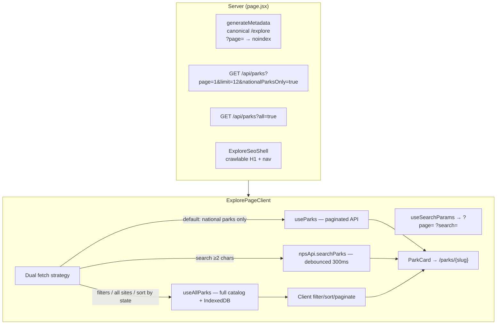

### 2.3 User flow

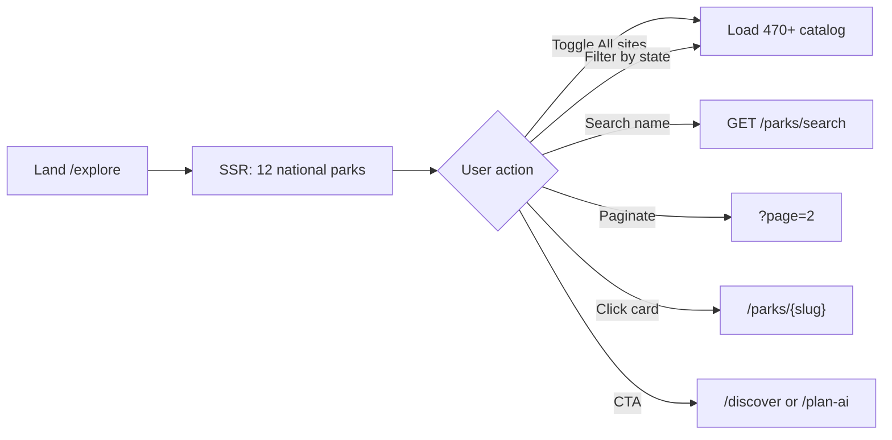

### 2.4 API endpoints

| Endpoint | When |
|----------|------|
| `GET /api/parks?page=&limit=&nationalParksOnly=` | Default grid + pagination |
| `GET /api/parks?all=true` | Full catalog (filters, “all sites”) |
| `GET /api/parks/search?q=&state=` | Debounced search |
| `GET /api/reviews/ratings` | Star ratings on cards |

**Backend:** `parkController.getAllParks`, `parkSearchService.executeParkSearch` · `server/src/routes/parks.js`  
**ISR:** `revalidate: 86400` (24h) on SSR fetches

---

## 3. Park detail (`/parks/[slug]`)

**Purpose:** Canonical park page — hero, live data, 16+ tabs with lazy-loaded NPS content, reviews, planning CTAs.

### 3.1 Route map

| File | Role |
|------|------|
| `app/parks/[parkCode]/page.jsx` | SSR, slug resolution, redirects, JSON-LD |
| `app/parks/[parkCode]/ParkDetailClient.jsx` | Tabs, sidebar, auth actions (~3.4k lines) |
| `app/parks/[parkCode]/activity/[id]/page.jsx` | Single activity deep link |
| `lib/parkApi.js` | Server fetch helpers |
| `lib/parkTabEndpoints.js` | Tab → API path mapping |
| `hooks/useParkTabData.js` | `useParkExploreIndex`, `useParkExploreTabBundle` |

### 3.2 URL & slug resolution

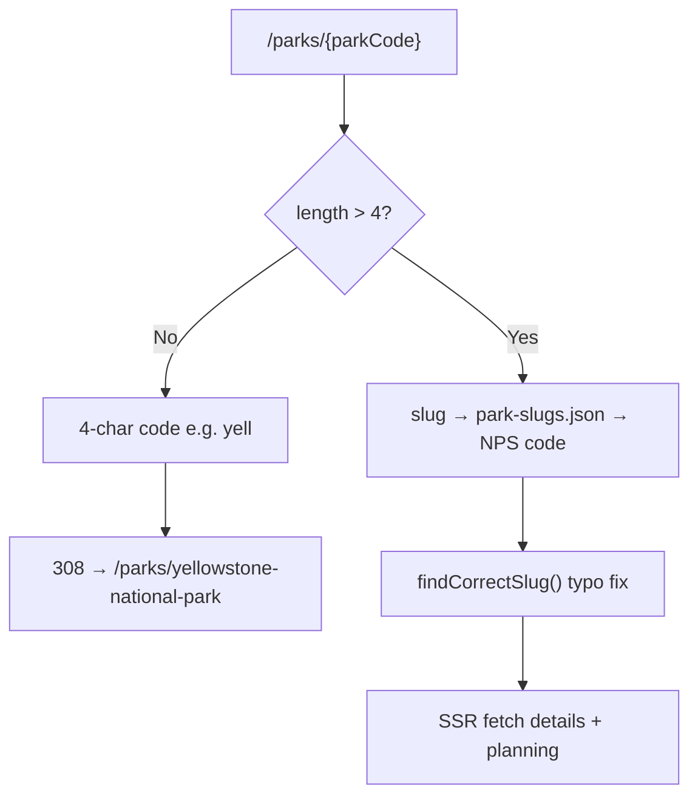

### 3.3 Three-tier data loading

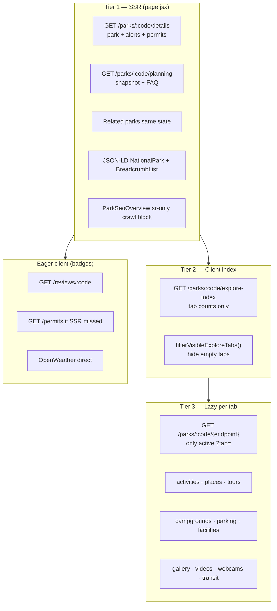

### 3.4 Tab model

| Tab ID | Label | Load |
|--------|-------|------|
| `overview` | Overview | SSR park object |
| `alerts` | Alerts | SSR |
| `permits` | Permits | SSR + eager refetch |
| `places` | What to See | Lazy |
| `activities` | Things to Do | Lazy |
| `tours` | Self-Guided Tours | Lazy |
| `visitorcenters` | Visitor Centers | Lazy |
| `camping` | Where to Stay | Lazy |
| `parking` | Parking & Access | Lazy |
| `facilities` | Amenities | Lazy |
| `transit` | Transit | Lazy (GTFS parks only) |
| `brochures` | Brochures | Lazy |
| `photos` | Photos | Lazy |
| `videos` | Videos | Lazy |
| `webcams` | Webcams | Lazy |
| `reviews` | Reviews | Lazy on first visit |

Tab state: `?tab=` via `router.replace` (no full navigation). Tab variants: **noindex**, canonical = base park URL.

### 3.5 User flow

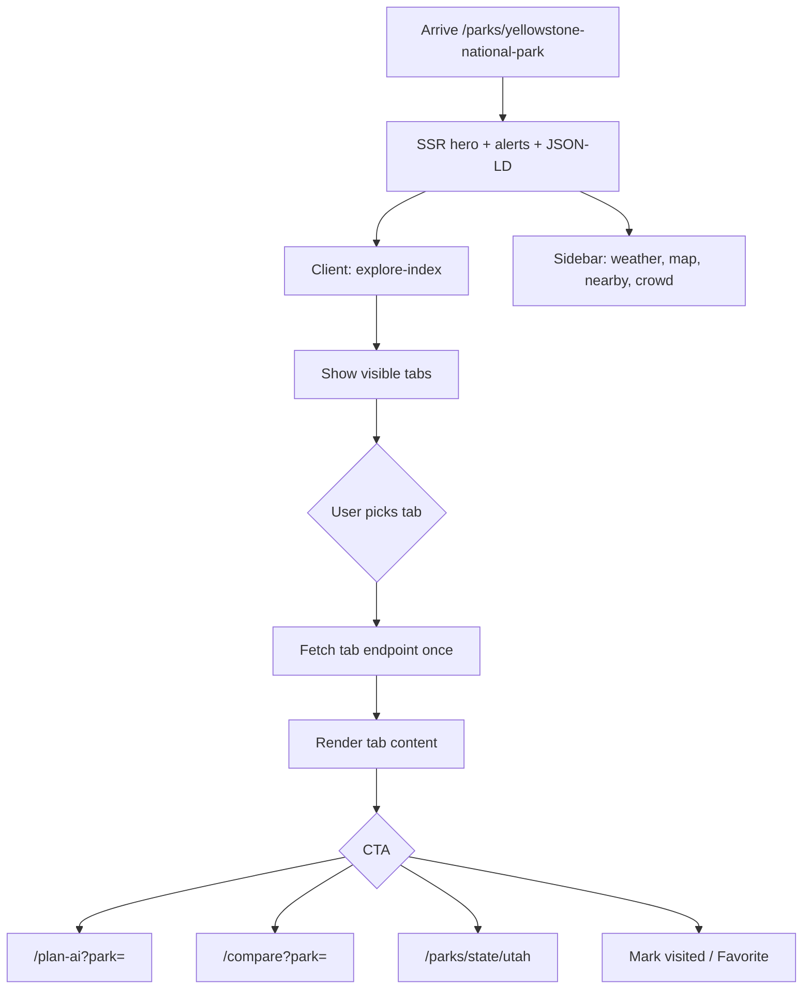

**Backend:** `parkController`, `parkExploreIndexService`, `npsService`, `ridbService`, `parkPlanningService` · `server/src/routes/parks.js`  
**Revalidate:** 3600s (1h) · **Sitemap:** all park slugs

---

## 4. Trailie (`/plan-ai`)

**Purpose:** AI trip planner — anonymous or authenticated chat, SSE streaming, discovery vs day-by-day itinerary, trip persistence.

### 4.1 Route map

| Route | File |
|-------|------|
| `/plan-ai` | `app/plan-ai/page.jsx` → `PlanAIContent.jsx` |
| `/plan-ai/[tripId]` | Existing trip chat |
| `/plan-ai/[tripId]/plan` | `PlanWorkspace` itinerary editor |
| `/plan-ai/shared/[shareId]` | Public shared trip (noindex) |
| `/plan-ai/guest/[anonymousId]` | Guest session resume link |

**Core components:** `TripPlannerChat.jsx`, `PlanAIShell.jsx`, `MessageBubble.jsx`, `DiscoveryPlanCta.jsx`, `QuickFillModal.jsx`  
**Orchestration:** `hooks/usePlanAI.js` (URL: `?park=`, `?ask=`, `?personalized=`)  
**API client:** `services/aiService.js` (SSE: `chunk` → `stream_end` → `done`)

### 4.2 Chat architecture

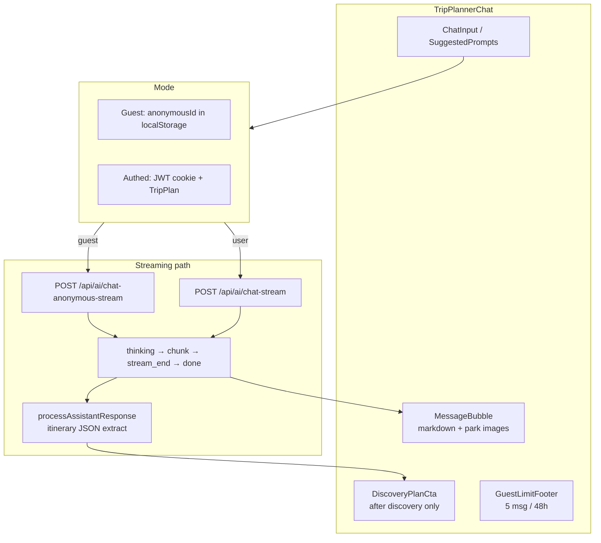

### 4.3 Backend: discovery vs itinerary

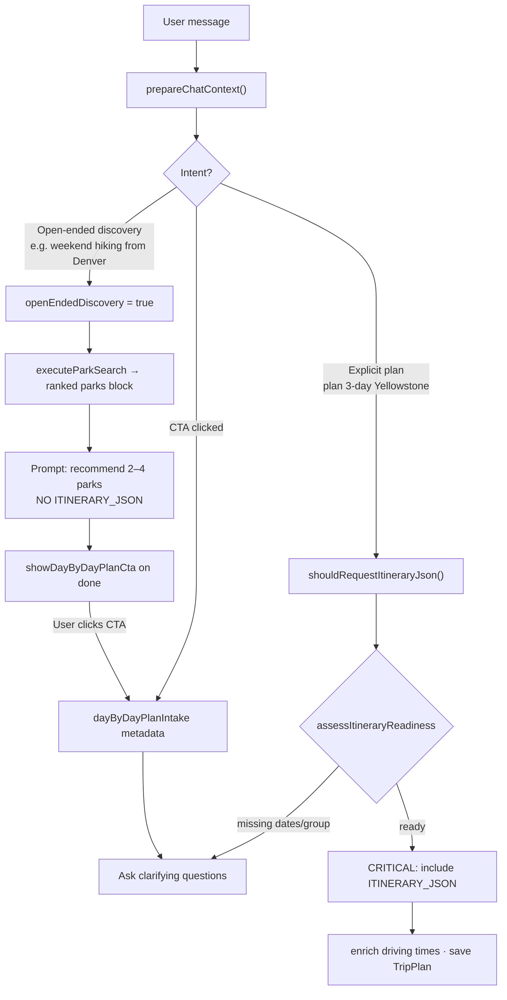

### 4.4 Auth & session flows

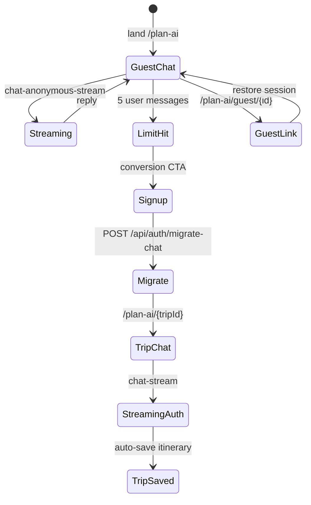

| Mode | Limit | Persistence |
|------|-------|-------------|
| Guest | 5 user msgs / 48h | `AnonymousSession` (Mongo) + localStorage |
| Authed | Token limits | `TripPlan` model, chat history |
| Voice | Separate | `VoiceButton` global FAB (hidden on `/plan-ai`); OpenAI Realtime |

**Key endpoints:** `POST /api/ai/chat-stream`, `chat-anonymous-stream`, `GET /api/ai/session-status/:id`, `POST /api/auth/migrate-chat`, `GET|PUT /api/trips/:tripId`

---

## 5. Events (`/events`)

**Purpose:** Browse NPS ranger programs + TrailVerse custom events; filter by month, category, search; local bookmarks.

### 5.1 Route map

| File | Role |
|------|------|
| `app/events/page.jsx` | SSR: current month events + summary |
| `app/events/EventsPageClient.jsx` | Filters, grid/list, pagination |
| `app/events/layout.jsx` | SEO + JSON-LD |
| `lib/eventsApi.js` | `getEventsServer()` |
| `services/eventService.js` | Client fetch (24h cache) |

### 5.2 Architecture

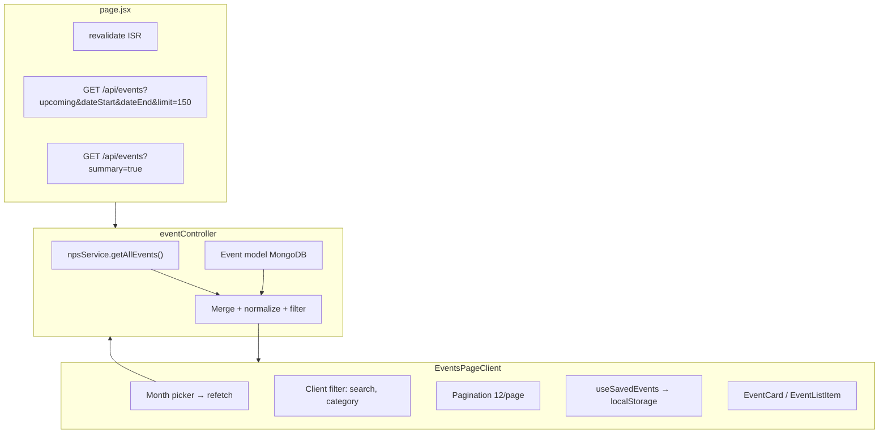

### 5.3 User flow

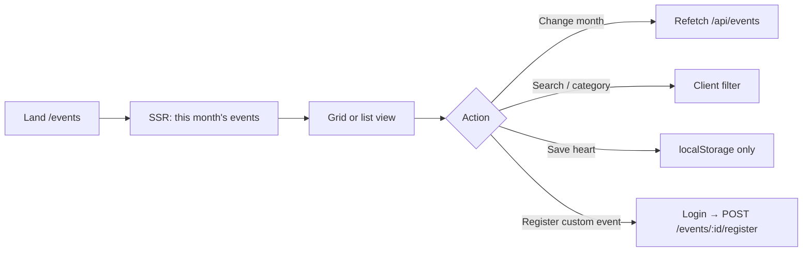

**Auth:** Browse = public · Save = localStorage · Register = `protect` JWT · Admin CMS = `admin` role

---

## 6. Compare (`/compare`)

**Purpose:** Side-by-side comparison of 2–4 parks — weather, crowd, facilities, parking, activities; shareable URLs and preset SEO landings.

### 6.1 Route map

| Route | File |
|-------|------|
| `/compare` | `app/compare/page.jsx` + `ComparePageClient.jsx` |
| `/compare/[slug]` | Preset landings e.g. `zion-vs-bryce` from `data/compareLandings.js` |
| `CompareUrlHydration.jsx` | Client `?parks=` fallback |
| `CompareLandingSeo.jsx` | Preset hero copy |

### 6.2 Architecture

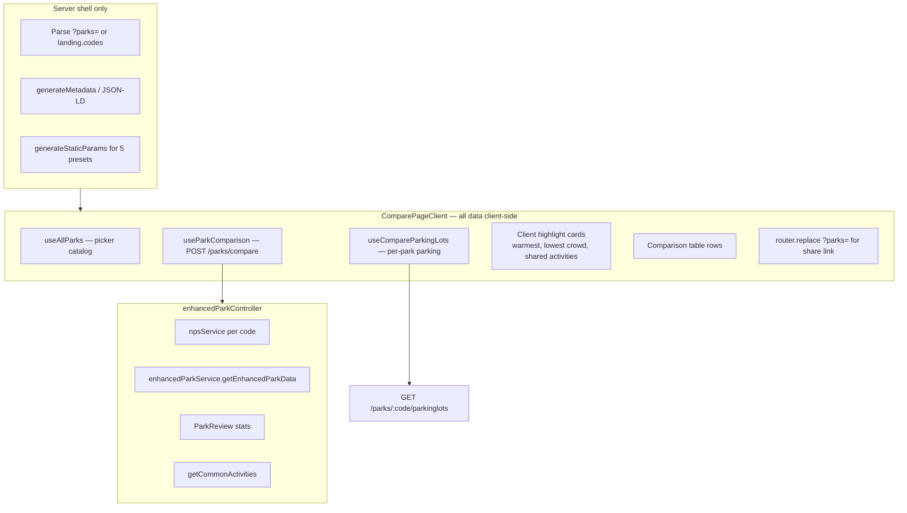

### 6.3 User flow

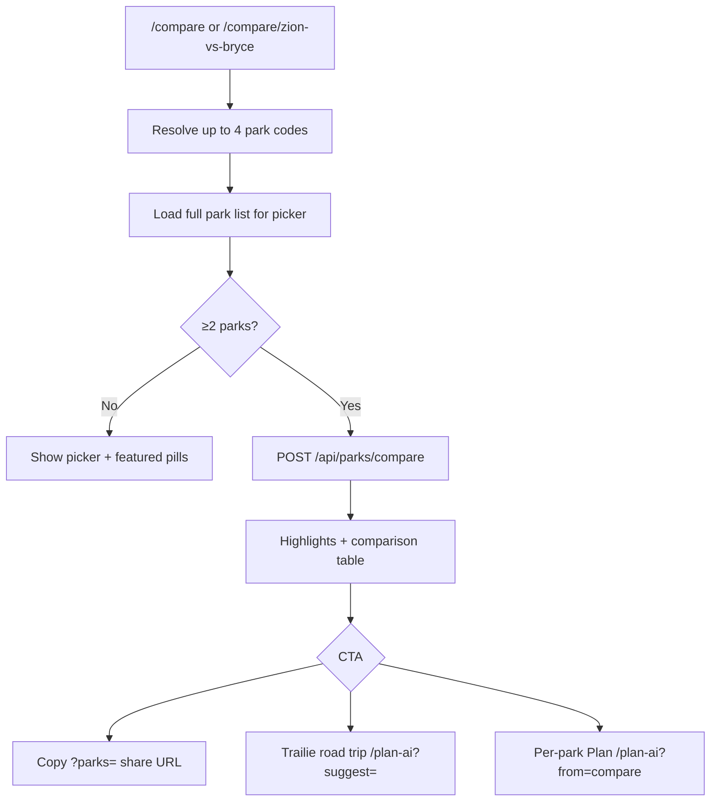

**Max parks:** 4 · **Stale time:** 30 min (React Query) · **No SSR comparison data** — SEO metadata only

---

## 7. Discover (`/discover`)

**Purpose:** Taxonomy hub — browse parks by activity, designation type, NPS topic, or state; curated featured picks per dimension.

### 7.1 Route map

| Route | Client / server |
|-------|-----------------|
| `/discover` | `DiscoverPageClient` — 4 preview sections |
| `/discover/activities` | `DiscoverFullGridPage` |
| `/discover/types` | same |
| `/discover/topics` | same |
| `/discover/states` | Grid → links to `/parks/state/{slug}` |
| `/discover/activity/[slug]` | `DiscoverDetailClient` |
| `/discover/type/[slug]` | same |
| `/discover/topic/[slug]` | same |
| `/parks/state/[stateCode]` | `StateParkPageClient` (state dimension) |

### 7.2 Architecture

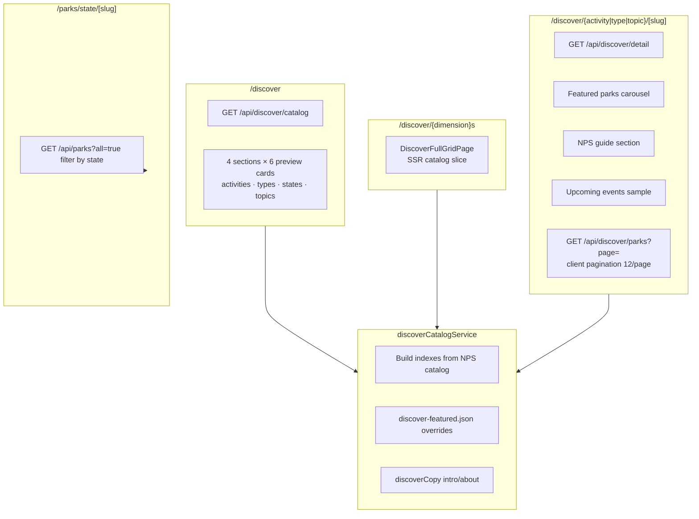

### 7.3 User flow

```mermaid
flowchart TD
  A[/discover hub] --> B{Pick dimension}
  B --> C[Preview card]
  B --> D[See all grid]
  C --> E{Type}
  D --> E
  E -->|activity/type/topic| F[Detail page]
  E -->|state| G[/parks/state/utah]
  F --> H[Featured + NPS guide + events]
  H --> I[Paginated all parks]
  I --> J[ParkCard → /parks/slug]
  F --> K[RecentChips local visit tracking]
```

**ISR:** catalog 3600s · detail 1800s · **Hooks:** `useDiscoverCatalog`, `useDiscoverDetail`, `useDiscoverParksPage`

---

## 8. Cross-page patterns

### 8.1 SSR vs client matrix

| Page | SSR data | Client fetch | Pattern name |
|------|----------|--------------|--------------|
| Explore | First page + metadata | Pagination, search, filters | **Hybrid dual-fetch** |
| Park detail | Details + planning + JSON-LD | Tab lazy load | **Three-tier lazy tabs** |
| Trailie | Layout metadata only | SSE stream + session | **Client-heavy realtime** |
| Events | Month batch + summary | Month change refetch | **SSR hydrate + refetch** |
| Compare | URL codes + metadata | All comparison data | **SEO shell SPA** |
| Discover | Catalog / detail | Park pagination | **SSR + client pages** |

### 8.2 Navigation graph (main CTAs)

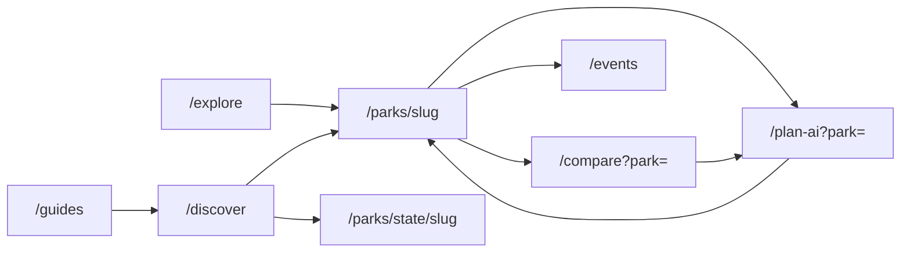

### 8.3 Auth touchpoints

| Page | Guest | Logged in |
|------|-------|-----------|
| Explore | Full browse | Same |
| Park detail | Browse; login for favorite/visited/review | Saved parks, reviews |
| Trailie | 5 messages; migrate on signup | Unlimited; trips saved |
| Events | Browse; local save | Register for custom events |
| Compare | Full compare | Personalized Trailie CTA |
| Discover | Full browse | Saved events on detail |

### 8.4 Key file index

```
next-frontend/src/app/
├── explore/          page.jsx, ExplorePageClient.jsx
├── parks/[parkCode]/ page.jsx, ParkDetailClient.jsx
├── plan-ai/          page.jsx, PlanAIContent.jsx, [tripId]/*
├── events/           page.jsx, EventsPageClient.jsx
├── compare/          page.jsx, ComparePageClient.jsx, [slug]/page.jsx
└── discover/         page.jsx, DiscoverPageClient.jsx, */[slug]/page.jsx

server/src/
├── routes/parks.js, enhancedParks.js, discover.js, events.js, ai.js
├── controllers/parkController.js, discoverController.js, eventController.js, enhancedParkController.js
└── services/npsService.js, discoverCatalogService.js, enhancedParkService.js, parkSearchService.js
```

---

## Related docs

- [TRAILVERSE-AGENT-HANDBOOK.md](./TRAILVERSE-AGENT-HANDBOOK.md) — full agent context
- [.cursor/rules/01-frontend-pages.mdc](../.cursor/rules/01-frontend-pages.mdc) — route map
- [.cursor/rules/04-discover-and-parks.mdc](../.cursor/rules/04-discover-and-parks.mdc) — discover + park tabs
- [.cursor/rules/05-plan-ai-mcp-and-admin.mdc](../.cursor/rules/05-plan-ai-mcp-and-admin.mdc) — Trailie + voice

---

*Generated from codebase analysis — June 2026. Update when routes or API contracts change.*
