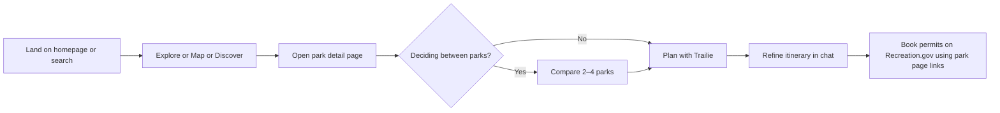
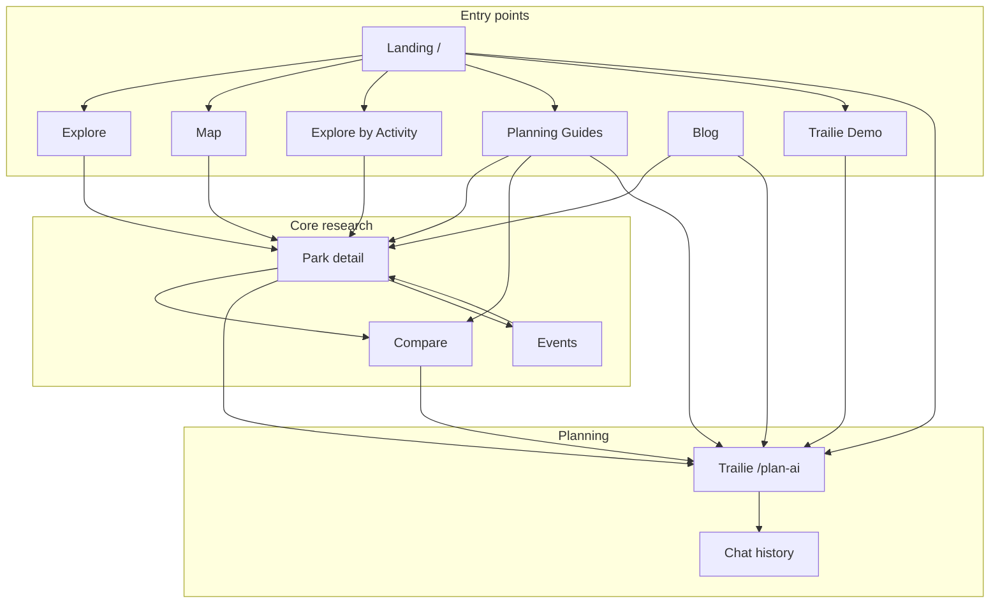

# TrailVerse — User Guide to Pages & Flows

**Website:** [nationalparksexplorerusa.com](https://www.nationalparksexplorerusa.com)

This document describes what TrailVerse is, what each major page contains, and how users move through the product. It is written for end users, support teams, and AI assistants (ChatGPT, Claude, etc.) that need to understand the site without implementation details.

**Trailie (AI planner):** See **[TRAILIE-USER-GUIDE.md](./TRAILIE-USER-GUIDE.md)** for the full end-to-end Trailie guide — capabilities, pipeline, tiers, voice, and distribution.

**Blog (Travel Journal):** See **[TRAILVERSE-BLOG-GUIDE.md](./TRAILVERSE-BLOG-GUIDE.md)** for categories, current article inventory, weekly publishing cadence, and blog vs Planning Guides.

**Park detail (single park hub):** See **[PARK-DETAIL-USER-GUIDE.md](./PARK-DETAIL-USER-GUIDE.md)** for every tab, sidebar, hero action, flows, and how park pages connect to Trailie and blog.

**Crowd Calendar & Home (Daily Feed):** See **[TRAILVERSE-CROWD-CALENDAR-AND-HOME-GUIDE.md](./TRAILVERSE-CROWD-CALENDAR-AND-HOME-GUIDE.md)** for the when-to-go report, signed-in `/home` briefing, and how they link to park pages.

---

## What TrailVerse is

TrailVerse is a free national parks exploration and trip-planning website covering **470+ National Park Service (NPS) sites** — not only the 63 headline “National Parks,” but also monuments, historic sites, seashores, recreation areas, and more.

**Core idea:** Discover parks → compare finalists → open a park page for live details → plan a trip with **Trailie** (the AI trip planner).

Most browsing works **without an account**. Sign-in is mainly for saving parks, saving trips, chat history, and unlimited Trailie planning.

---

## Who is Trailie?

**Trailie** is TrailVerse’s AI trip planner. In the site navigation it appears as **“Trailie”** and lives at `/plan-ai`.

Trailie helps users:

- Choose where to go (national parks, state parks, or other outdoor destinations)
- Compare options when they are deciding between parks
- Build day-by-day itineraries using live park data (alerts, weather, campgrounds, permits)
- Refine plans in follow-up messages (“make it more relaxed,” “add a sunset spot,” etc.)

**Trailie Demo** (`/trailie-demo`) is a separate page where users can **watch sample conversations** play out — it is not the live chat. Live chat is on `/plan-ai`.

---

## Main navigation (header)

| Nav label | Page | Who sees it |
|-----------|------|-------------|
| **Home** | `/home` | Logged-in only — **daily Park of the Day briefing** (weather, alerts, insights). See [Crowd Calendar & Home guide](./TRAILVERSE-CROWD-CALENDAR-AND-HOME-GUIDE.md). |
| **Explore** | `/explore` | Everyone |
| **Map** | `/map` | Everyone |
| **Trailie** | `/plan-ai` | Everyone |
| **Blog** | `/blog` | Everyone (guests: top nav; logged-in: under “More”) |
| **More → Events** | `/events` | Everyone |
| **More → Compare** | `/compare` | Everyone |
| **More → Explore by Activity** | `/discover` | Everyone |
| **More → Chat History** | `/chat-history` | Logged-in only |
| **More → Profile** | `/profile` | Logged-in only |

**Footer** also links to **Planning Guides** at `/guides` and **Crowd Calendar** at `/reports/when-to-go`.

**Landing page** (`/`) is the public homepage with search, featured parks, blog highlights, and a link to the Trailie demo.

---

## Overall trip-planning flow

Most users follow one of these paths:

**Alternate entry points:**

- Start on **Compare** if they already know which parks to weigh
- Start on **Trailie** or **Trailie Demo** if they want AI help first
- Start on **Planning Guides** if they want advice before picking parks
- Start on **Events** if they are planning around ranger programs

---

## Page-by-page guide

### 1. Explore (`/explore`)

**Purpose:** Browse the full park catalog in a searchable grid or list.

**What’s on the page:**

- Search bar — find parks by name, state, or description
- **National Parks Only** toggle — default shows ~64 national parks; turn off to see all 470+ NPS sites
- **Filter by state** — multi-select checkboxes for U.S. states and territories
- **Sort** — by name, state, or other options
- **Grid / List view** toggle
- **Pagination** — parks shown in pages (12 per page by default)
- Park cards — each shows image, name, state, designation, and links to the park detail page
- Link to **Explore by Activity** for mood-based browsing

**Typical user flow:**

1. Land on Explore
2. Search or filter (e.g., “Utah” + National Parks Only off)
3. Click a park card → park detail page
4. Optional: use “Plan with Trailie” from a park or from Explore CTAs

**Account needed?** No.

---

### 2. Map (`/map`)

**Purpose:** See all parks on an interactive full-screen map and explore geographically.

**What’s on the page:**

- Full-screen map with park markers across the U.S.
- **Search** — find a park by name and jump to it on the map
- **Zoom controls** and reset view
- **Toggle layers:**
  - Points of interest (“places”) inside parks
  - Campgrounds
- Click a park marker → preview card with name, rating, and link to park detail
- Click a campground or place → details panel with link into the relevant park tab (camping, places, etc.)

**Layout:** Desktop shows a sidebar + map; mobile is map-first with overlays.

**Typical user flow:**

1. Open Map
2. Pan/zoom to a region or search for a park
3. Tap a marker → preview → “View park” → park detail page
4. Optional: toggle campgrounds to see where to stay

**Account needed?** No.

---

### 3. Explore by Activity (`/discover`)

**Nav label:** “Explore by Activity”  
**URL:** `/discover` (the URL says “discover”; the user-facing name is “Explore by Activity”)

**Purpose:** Find parks by what you want to do, what type of site it is, where it is, or what topic interests you — instead of scrolling the full catalog.

**Hub page sections (each shows preview cards + “See all”):**

| Section | Example | Leads to |
|---------|---------|----------|
| **Activities** | Hiking, camping, stargazing | `/discover/activity/hiking` |
| **Type** | National Park, Monument, Historic Site | `/discover/type/parks` |
| **States** | Utah, Maine, etc. | `/parks/state/utah` |
| **Topics** | Animals, military history, trails | `/discover/topic/animals` |

**Detail pages** (e.g., `/discover/activity/hiking`):

- Grid of matching parks with pagination
- Optional NPS guide article section for context
- Each park links to its park detail page

**Typical user flow:**

1. Open Explore by Activity
2. Pick a dimension (e.g., Activity → Stargazing)
3. Browse matching parks
4. Open a park → detail page, or Compare several finalists

**Account needed?** No.

---

### 4. Compare (`/compare`)

**Purpose:** Put **2 to 4 parks side by side** to decide which fits best for dates, weather, crowds, and trip style.

**What’s on the page:**

- Park picker with search and featured suggestions
- Selected parks shown as columns
- Comparison sections (expandable), including:
  - AI-style summary of differences
  - Location and states
  - Ratings and reviews
  - Best time to visit
  - Current weather and seasonal ranges
  - Crowd level signals
  - Entrance fees
  - Top activities
  - Campgrounds and parking overview
- **Copy link** — share the comparison URL (e.g., `/compare?parks=yell,yose,grca`)
- **Plan with Trailie** CTA — starts chat with the compared parks in context
- Links from each column to individual park detail pages

**Typical user flow:**

1. Add 2–4 parks (search or pick from suggestions)
2. Read comparison summary and weather/crowd rows
3. Remove parks until one or two finalists remain
4. Click “Plan with Trailie” or open a park detail page
5. Optional: copy link to share with a travel partner

**Account needed?** No. Saved/visited badges appear if logged in.

---

### 5. Park detail (`/parks/{park-name}`)

**Purpose:** Everything about **one park** in one place — the main research hub on TrailVerse (470+ NPS sites).

**Full park detail guide:** **[PARK-DETAIL-USER-GUIDE.md](./PARK-DETAIL-USER-GUIDE.md)** — all 16 tabs, sidebar, hero actions, FAQ, related parks, flows, and vs blog/Trailie.

**Example URL:** `/parks/yellowstone-national-park` · Deep links: `?tab=alerts`, `?tab=permits`, `?tab=reviews&write=1`

**Page structure (summary):**

| Area | What's there |
|------|----------------|
| **Hero** | Photo, name, state, Mark Visited, Favorite, Share |
| **Quick info** | Hours, entrance fee, phone, official NPS site |
| **Trailie block** | At-a-glance facts, Plan with Trailie, Compare link |
| **Tabs** | Overview, Alerts, What to See, Things to Do, Tours, Visitor Centers, Where to Stay, Parking, Amenities, Transit*, Brochures, Permits, Photos, Videos, Webcams, Reviews |
| **Sidebar** | Live weather, map/directions, nearby lodging/food/gas, crowd calendar*, blog guides*, Planning Guides |
| **Bottom** | Planning FAQ, related parks in state |

\*Transit tab and crowd calendar only on supported parks.

**Typical flow:** Overview + Alerts → Permits → Things to Do → Plan with Trailie.

**Account:** No account to read; sign-in for favorites, visited, reviews.

---

### 6. Trailie — live chat (`/plan-ai`)

**Purpose:** Interactive AI trip planning — the real Trailie experience.

**Full Trailie guide:** **[TRAILIE-USER-GUIDE.md](./TRAILIE-USER-GUIDE.md)** — end-to-end pipeline, capabilities, guest vs signed-in, Quick Fill, My Recommendations, voice, ChatGPT/Claude, demo vs live.

**Summary:**

- Compare parks, build day-by-day itineraries, live NPS alerts/weather/permits when available
- **Quick Fill** — 4-step form (National Parks); free chat accepts any destination
- **Guests:** 5 messages / ~48h, no web search | **Signed-in (free):** unlimited, save/share/PDF, web for state parks, **My Recommendations** after 3 planned parks
- **Talk to Trailie** voice on most pages (3 free voice sessions for guests)

**Typical flow:** Open Trailie → describe trip or Quick Fill → refine in chat → sign up to save or continue past guest limit.

**Related:** `/plan-ai/{tripId}/plan`, `/chat-history`, `/plan-ai/shared/{shareId}`

---

### 7. Trailie Demo (`/trailie-demo`)

**Purpose:** **Preview** what Trailie can do — watch recorded sample chats, not live AI.

**What’s on the page:**

- Intro explaining the demo
- Interactive playback with **4 sample scenarios:**
  1. **Compare** — Yosemite vs Sequoia for a 3-day September trip
  2. **Itinerary** — 2-day Zion trip for a couple (includes a follow-up turn)
  3. **Logistics** — One day at Glacier; parking and backup plans
  4. **State park** — Relaxed weekend at Valley of Fire from Las Vegas
- User can switch scenarios and watch questions type out and answers appear
- CTA to open **live Trailie** at `/plan-ai`

**Typical user flow:**

1. Land from homepage “View Trailie demo” or direct link
2. Watch one or more scenarios
3. Click through to live Trailie to plan their own trip

**Account needed?** No.

**Important distinction for AI assistants:** Demo answers are pre-recorded samples. Live Trailie on `/plan-ai` uses current data and accepts any user question.

---

### 8. Events (`/events`)

**Purpose:** Find **upcoming ranger programs and park events** from NPS listings.

**What’s on the page:**

- Month selector — browse events for the next 12 months
- Search by event name or keyword
- **Category filters** (e.g., guided hike, talk, festival)
- **Grid / List view**
- Event cards — title, date, time, park, description
- **Save event** — bookmark for later (stored locally for guests; synced for signed-in users)
- Link from each event to the relevant park

**Typical user flow:**

1. Open Events
2. Pick a month near travel dates
3. Filter or search (e.g., “ astronomy ” or a park name)
4. Save interesting events
5. Open the park page for logistics and plan with Trailie

**Account needed?** No to browse. Sign-in improves saved-events sync across devices.

---

### 9. Blog (`/blog`)

**Purpose:** Read TrailVerse’s **Travel Journal** — expert articles on park planning, 2026 rule changes, astrophotography, seasonal trips, and timely travel tips.

**Full blog guide:** **[TRAILVERSE-BLOG-GUIDE.md](./TRAILVERSE-BLOG-GUIDE.md)** — full category inventory, weekly publishing cadence, article types, and how blog differs from Planning Guides.

**Not the same as Planning Guides (`/guides`):** Blog = weekly **articles** (park deep dives, astro, news). Planning Guides = tool comparisons + ranked “Parks by vibe” lists.

**Publishing cadence:** New content **every week** — typically a **2026 park Complete Guide** (`national-parks`), often followed ~2 days later by a matching **astrophotography guide** for the same park.

**What’s on the hub (`/blog`):**

- **Featured Stories** and **Popular Posts**
- **Category navigation** (full archives on category pages)
- Newsletter signup
- Links to special reports (e.g., crowd calendar)

**Categories (live library ~29 posts, growing weekly):**

| Category | What it covers | Examples |
|----------|----------------|----------|
| **National Parks** | 2026 visitor guides per flagship park | Glacier shuttle rules, Zion crowds, Grand Canyon North Rim |
| **Astrophotography** | Milky Way, Bortle class, night locations | Zion, Glacier, Grand Canyon astro guides |
| **Trip Planning** | Timely news & holidays | Yosemite timed entry change, Memorial Day crowds |
| **Park Guides** | Evergreen audience picks | First-timers, America the Beautiful pass math |
| **Seasonal Guides** | Fall color, seasonal road trips | Best parks for fall, foliage routes |

**Individual post** (`/blog/{slug}`): full article, author, read time, related posts, optional likes/comments (sign-in), links to **park pages** and **Trailie**.

**Typical user flow:**

1. Land on blog hub or a post from search/social
2. Read park-specific 2026 guide
3. Open linked **park detail page** for live alerts
4. **Plan with Trailie** or **Compare** if still deciding

**Account needed?** No to read.

---

### 10. Planning Guides (`/guides`)

**Purpose:** Hub for **planning articles** and **ranked park lists by trip vibe**.

Two types of content live here:

#### A. Planning & tools (editorial articles)

Long-form guides at `/guides/{slug}`. Topics include:

- Best free national park trip planner
- TrailVerse vs AllTrails
- Planning parks in ChatGPT
- Yosemite vs Yellowstone for first-timers
- Best national park apps
- TrailVerse vs Recreation.gov and NPS app
- How to compare parks on TrailVerse
- How to find permits and reservations

Each article has: quick answer, sections, FAQ, and links to TrailVerse tools.

#### B. Parks by vibe (ranked lists)

Curated lists for specific trip types. Each page includes:

1. **Quick answer** — short recommendation up top
2. **The standouts** — ~8 parks with editorial blurbs (why each fits)
3. **Plan on TrailVerse** — links to Compare, Trailie, etc.
4. **Top matches** — live-ranked grid with “why it matches” notes
5. **FAQ**
6. **Related searches** — links to other vibe lists

**Vibe list pages:**

| Page | Topic |
|------|-------|
| `/parks-for-couples` | Romantic/scenic parks |
| `/parks-for-photography` | Photography |
| `/ocean-national-parks` | Coast and ocean |
| `/fall-color-parks` | Fall foliage |
| `/quiet-national-parks` | Quiet escapes |
| `/dark-sky-parks` | Stargazing |
| `/parks-for-families` | Family-friendly |
| `/parks-for-first-timers` | First-time visitors |
| `/dog-friendly-parks` | Dogs allowed (with rules) |
| `/winter-national-parks` | Winter visits |
| `/accessible-national-parks` | Accessibility |
| `/wildlife-national-parks` | Wildlife viewing |

**Typical user flow:**

1. Open `/guides`
2. Either read a planning article OR open a vibe list
3. Read standouts → check Top matches grid
4. Compare finalists or open park pages
5. Plan with Trailie

**Account needed?** No.

---

## Account & profile (brief)

| Feature | Guest | Signed-in (free) |
|---------|-------|------------------|
| Browse Explore, Map, Discover, Compare | Yes | Yes |
| Read park pages, blog, guides, events | Yes | Yes |
| Trailie chat | Limited messages | Unlimited |
| Save favorite parks | Prompt to sign in | Yes — `/profile` |
| Mark parks visited | Prompt to sign in | Yes — `/profile` |
| Saved trips & chat history | No | Yes — `/chat-history` |
| Write park reviews | No | Yes |
| Personalized Trailie suggestions | No | After 3+ parks planned |

**Profile** (`/profile`): saved parks, visited parks, reviews, account settings.

**Home** (`/home`): signed-in **daily feed** — one Park of the Day with weather, alerts, nature fact, and planning insights. Full guide: [TRAILVERSE-CROWD-CALENDAR-AND-HOME-GUIDE.md](./TRAILVERSE-CROWD-CALENDAR-AND-HOME-GUIDE.md).

---

## How pages connect (reference diagram)

---

## Common user questions (for AI assistants)

**“Do I need to pay or sign up?”**  
No payment. Most of the site is free without an account. Sign up (free) for unlimited Trailie, saved trips, favorites, and chat history.

**“What’s the difference between Explore and Explore by Activity?”**  
Explore is the full searchable catalog with state filters. Explore by Activity groups parks by activity, type, topic, or state — better when you know the vibe but not the park name.

**“What’s the difference between Trailie Demo and Trailie?”**  
Demo = watch sample chats. Trailie (`/plan-ai`) = live AI you can talk to.

**“How many parks can I compare?”**  
Two to four at once on `/compare`.

**“Does TrailVerse book campsites or permits?”**  
No. Park pages link to Recreation.gov for official reservations. Trailie suggests what to book; users book on official sites.

**“What parks are included?”**  
470+ NPS sites (national parks plus monuments, historic sites, seashores, etc.). Trailie can also discuss state parks and other outdoor destinations in conversation.

---

## Suggested review checklist (for QA or AI page audit)

When checking that pages work for users, walk through:

1. **Explore** — search, state filter, national-parks toggle, open a park
2. **Map** — search a park, open preview, toggle campgrounds
3. **Explore by Activity** — open one activity and one state list
4. **Compare** — add 2 parks, read summary, copy link
5. **Park detail** — alerts tab, permits tab, Plan with Trailie button
6. **Trailie Demo** — play all 4 scenarios, follow CTA to live chat
7. **Trailie** — send a planning message, ask one follow-up
8. **Events** — change month, open an event’s park
9. **Blog** — open featured post, use category filter
10. **Planning Guides** — open hub, one editorial guide, one vibe list (e.g., couples)

---

*Last updated: June 2026. For product behavior changes, prefer live pages at nationalparksexplorerusa.com over this document.*
