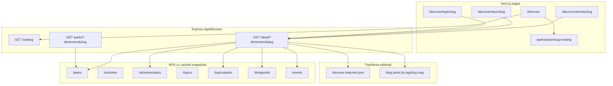

# Discover Page — Implementation Plan

## Problem

TrailVerse’s `/explore` page is a **park list with search and sidebar filters**. Activity discovery is limited to nine hard-coded pills and does not match how visitors browse in the official NPS app: by **activity**, **state**, **park type (designation)**, and **topic**.

We need a dedicated **`/discover`** experience that:

- Mirrors NPS dimensional browse (hub + “See all” grids).
- Delivers **rich result pages** when someone taps e.g. Astronomy—not only a flat park list.
- Leaves **`/explore` unchanged** except removing redundant activity filters (state + national-parks-only stay).

## Target experience (Level 3)

When someone taps **Astronomy** (or **Wildlife Watching**, a monument type, a topic, etc.), they get a **full destination page**—not a bare filter view.

### Example: `/discover/activity/astronomy`

```
┌──────────────────────────────────────────────────────────┐
│  ← Discover          Astronomy                           │
│  Short intro copy (TrailVerse editorial, NPS-attributed   │
│  where we have public fields)                            │
├──────────────────────────────────────────────────────────┤
│  ★ Great parks for stargazing                            │
│  Horizontal cards — TrailVerse curated (5 parks)         │
│  Source: discover config + blog links + park metadata    │
├──────────────────────────────────────────────────────────┤
│  Ranger programs & night-sky experiences                 │
│  Carousel/list from NPS thingstodo tagged astronomy      │
│  (title, park name, link to park activity tab)           │
├──────────────────────────────────────────────────────────┤
│  Related from TrailVerse (when available)                │
│  Blog guides (e.g. astro guides), optional events strip  │
├──────────────────────────────────────────────────────────┤
│  All parks with astronomy (NPS)                          │
│  Count + sortable grid — official /activities/parks set  │
│  TrailVerse park cards → /parks/[parkCode]               │
└──────────────────────────────────────────────────────────┘
```

**Data honesty:** The NPS mobile app’s long essays and “five best” modules are partly **app editorial**, not fully exposed as one API blob. We reproduce that **feel** by combining:

| Block | Source | Authority |
|-------|--------|-----------|
| Who has this activity/topic | NPS `/activities/parks`, `/topics/parks` | Official |
| Park names, images, descriptions | Cached NPS `/parks` via TrailVerse API | Official |
| Programs & experiences | NPS `/thingstodo` (filter by activity name/id) | Official |
| “Great parks for …” | TrailVerse **featured config** (+ optional blog/ratings boost) | Editorial |
| Intro paragraph | TrailVerse copy per slug (+ optional NPS snippet) | Editorial |
| Related guides | TrailVerse `/blog` posts mapped by slug/tags | Editorial |

**Birdwatching:** Grid shows **NPS taxonomy labels only** (e.g. “Wildlife Watching”). No fake “Birdwatching” tile unless NPS lists it.

### Same richness model for other dimensions

| Result route | Featured block | NPS full list | Extra NPS | TrailVerse extras |
|--------------|----------------|---------------|-----------|-------------------|
| `/discover/activity/[slug]` | “Great parks for …” | All activity parks | thingstodo, events | blog guides |
| `/discover/topic/[slug]` | “Highlights” (optional) | All topic parks | thingstodo where tagged | blog if mapped |
| `/discover/type/[slug]` | Optional featured | All parks by designation group | — | — |
| State | — | — | — | Link to existing `/parks/state/[slug]` |

Type and topic pages use the same **detail page shell**; featured + programs sections are **required for activities**, **strongly recommended for topics**, **optional for type**.

## What we do not build

- Map bottom sheet behind discover (NPS screenshot 4).
- Replacing or duplicating `/parks/state/[stateCode]` — discover **links out**.
- Changing `/explore` search, pagination, or layout (only remove activity filters).
- Taxonomy browse via the old nine-bucket `normalizeActivityName()` mapping.

## Architecture



## Routes

| Route | Purpose |
|-------|---------|
| `/discover` | Hub: search, recent chips, preview grids (Activities, Type, States, Topics) |
| `/discover/activities` | Full activity grid |
| `/discover/activity/[slug]` | **Rich activity destination** (Level 3) |
| `/discover/types` | Full designation/type grid |
| `/discover/type/[slug]` | Type result (featured optional + full park list) |
| `/discover/topics` | Full topic grid |
| `/discover/topic/[slug]` | **Rich topic destination** |
| `/parks/state/[stateCode]` | Existing — state tiles on hub link here |

**Slugs:** `slugify(NPS name)` → lowercase, hyphenated; store `slug → { id, name }` in catalog snapshot for stable URLs.

**Hub text search:** submits to `/explore?search={q}` (explore remains text-search home).

## Backend

### NPS service additions

**File:** `server/src/services/npsService.js`

| Method | NPS endpoint | Notes |
|--------|--------------|-------|
| `getActivityTaxonomy()` | `GET /activities` | Paginate; 7-day snapshot |
| `getActivityParks(activityId)` | `GET /activities/parks` | Per id or bulk index at catalog build |
| `getTopicTaxonomy()` | `GET /topics` | Same cache pattern |
| `getTopicParks(topicId)` | `GET /topics/parks` | Same |
| `getThingsToDoByActivity(activityName, limit)` | `GET /thingstodo` | Filter client-side by `activities[].name` or id |
| `getEventsForParks(parkCodes, limit)` | `GET /events` | Optional strip on detail pages |

Rename mentally: existing `getAllActivities()` = **thingstodo bulk**, not taxonomy—do not use it for discover grids.

### Discover catalog service

**New file:** `server/src/services/discoverCatalogService.js`

Builds and caches (Mongo snapshot + in-memory, same pattern as parks):

**`GET /api/discover/catalog`**

```js
{
  activities: [{ id, name, slug, parkCount, iconKey }],
  topics: [{ id, name, slug, parkCount }],
  types: [{ name, slug, parkCount }],   // grouped designations
  states: [{ code, name, slug, parkCount }],
  updatedAt
}
```

- **states / types:** aggregate from `getAllParks()`.
- **activities / topics:** taxonomy + park counts from `/activities/parks` and `/topics/parks` (build inverted index at catalog refresh).
- **Designation groups:** map raw `designation` → NPS-app labels (Parks, Monuments, Historic Sites, Memorials, Other Designations, …).

### Discover detail service

**Same file or `discoverDetailService.js`**

**`GET /api/discover/detail?dimension=activity|topic|type&slug=astronomy`**

Single payload for the rich page:

```js
{
  dimension,
  slug,
  title,
  intro,                    // editorial string from config
  nps: {
    activityId,             // or topicId
    parkCount
  },
  featured: {
    title,                  // e.g. "Great parks for stargazing"
    parks: [ /* full park objects, max 5–8 */ ]
  },
  programs: [               // thingstodo summaries
    { id, title, parkCode, parkName, shortDescription, url }
  ],
  relatedContent: {
    blogPosts: [{ slug, title, excerpt, image }]
  },
  parks: [ /* all NPS-matched parks, full objects */ ],
  events: [ /* optional, upcoming at featured/all parks */ ],
  meta: { stale, updatedAt }
}
```

**Featured parks resolution order:**

1. Explicit list in `server/data/discover-featured.json` keyed by `activity:astronomy`, `topic:animals`, etc.
2. If list empty: heuristic fallback (e.g. astronomy → parks with topic/id night sky or thingstodo count; cap at 5).
3. Every featured park **must** appear in the NPS activity/topic park set (no orphans outside taxonomy).

**Intro copy:** `discover-featured.json` or `discover-copy.json` per slug; fallback generic template: “Explore {count} parks and sites where the National Park Service lists {title}.”

### Parks list endpoint (pagination / client cache)

**`GET /api/discover/parks?dimension=activity&slug=astronomy&page=1&limit=24`**

Returns slice of park list for infinite scroll without re-fetching full detail. Detail endpoint can return full list for SSR; client pagination optional.

### Routes and controller

- `server/src/controllers/discoverController.js`
- `server/src/routes/discover.js` → mount `/api/discover`
- Register in app router.

**Cache headers:** `Cache-Control: public, max-age=3600, s-maxage=86400` on catalog; detail can cache 1h with stale-while-revalidate.

**Warm job:** optional `server/scripts/warm-discover-catalog.js` after deploy.

## Frontend

### Data layer

| File | Role |
|------|------|
| `next-frontend/src/lib/discoverApi.js` | `getCatalog()`, `getDetail(dimension, slug)`, `getParksPage()` |
| `next-frontend/src/hooks/useDiscoverCatalog.js` | React Query, 24h stale |
| `next-frontend/src/hooks/useDiscoverDetail.js` | Detail page query |

### Components

**Directory:** `next-frontend/src/components/discover/`

| Component | Role |
|-----------|------|
| `DiscoverSearchBar.jsx` | Pill search → `/explore?search=` |
| `RecentChips.jsx` | `localStorage` recent dimension+slug |
| `DiscoverSection.jsx` | Hub section header + “See all” + 2-col preview |
| `DiscoverGridCard.jsx` | Activity/topic/type tile with icon + count |
| `ActivityIcon.jsx` | Name → Lucide icon map (~35 activities + fallback) |
| `DiscoverDetailHero.jsx` | Title + intro |
| `DiscoverFeaturedParks.jsx` | Horizontal “Great parks…” strip |
| `DiscoverProgramsList.jsx` | thingstodo cards |
| `DiscoverRelatedGuides.jsx` | Blog cards |
| `DiscoverParkGrid.jsx` | Full NPS list; reuses explore `ParkCard` / `OptimizedImage` |
| `DiscoverEventsStrip.jsx` | Optional upcoming events |
| `DiscoverEmptyState.jsx` | No parks / API stale messaging |

Design: NPS-like 2-column mobile grids on hub; TrailVerse tokens (`var(--surface)`, forest accent).

### Pages (all ship together)

| File | Renders |
|------|---------|
| `next-frontend/src/app/discover/layout.jsx` | SEO, shared layout |
| `next-frontend/src/app/discover/page.jsx` | Hub (SSR catalog) |
| `next-frontend/src/app/discover/DiscoverPageClient.jsx` | Hub interactivity |
| `next-frontend/src/app/discover/activities/page.jsx` | Full activity grid |
| `next-frontend/src/app/discover/activity/[slug]/page.jsx` | Rich activity detail (SSR detail API) |
| `next-frontend/src/app/discover/types/page.jsx` | Full type grid |
| `next-frontend/src/app/discover/type/[slug]/page.jsx` | Type detail |
| `next-frontend/src/app/discover/topics/page.jsx` | Full topic grid |
| `next-frontend/src/app/discover/topic/[slug]/page.jsx` | Rich topic detail |

**Activity/topic detail pages:** server-fetch `GET /api/discover/detail` in `page.jsx` for SEO (title, description, JSON-LD `ItemList` of parks).

**National parks toggle on result pages only:** default **all NPS units** in list; toggle filters to designation containing “National Park” (client-side on loaded parks).

### Editorial config

**New file:** `server/data/discover-featured.json`

```json
{
  "activity:astronomy": {
    "intro": "Dark skies, ranger-led night programs, and Milky Way views across the National Park System.",
    "featuredTitle": "Great parks for stargazing",
    "featuredParkCodes": ["grba", "grca", "acad", "bryce", "cuva"],
    "blogSlugs": ["zion-national-park-astrophotography-guide-2026"]
  }
}
```

Seed entries for: Astronomy, Hiking, Camping, Wildlife Watching, Biking, Fishing, Guided Tours, Museum Exhibits (match NPS screenshot set). Expand over time.

### Explore cleanup (only explore change)

**File:** `next-frontend/src/app/explore/ExplorePageClient.jsx`

Remove activity filtering entirely:

- `popularActivities`, `filters.activities`, `toggleActivityFilter`
- `activityFiltersActive`, `useAllParks(..., includeActivities)`
- Activity UI in desktop sidebar and mobile filter sheet
- Activity counts in `hasActiveFilters` / `clearAllFilters`

Keep: search, states, national-parks-only, sort, pagination.

## Navigation & SEO

- **Header:** add `{ path: '/discover', label: 'Discover' }`; keep Explore.
- **Landing:** CTA “Browse by activity” → `/discover`.
- **Sitemap:** `/discover`, `/discover/activities`, `/discover/topics`, every activity/topic slug from catalog snapshot.
- **Metadata templates:**
  - Activity: `{Activity} | Discover National Parks`
  - Description: intro sentence + park count.
- **Structured data:** `CollectionPage` + `ItemList` of parks on detail pages.

## Analytics

| Event | When |
|-------|------|
| `discover_hub_view` | Hub load |
| `discover_see_all` | Section “See all” |
| `discover_select` | Tile tap (dimension, slug) |
| `discover_featured_park_click` | Featured strip |
| `discover_program_click` | thingstodo card |
| `discover_park_click` | Full list card |

## Tests

### Server

| Test | Assert |
|------|--------|
| Catalog 200 | All four sections non-empty with valid NPS key |
| Catalog cache | Second request does not hit NPS (mock) |
| Detail activity | `astronomy` returns intro, featured ⊆ parks, programs array |
| Detail invalid slug | 404 |
| Parks filter | `dimension=activity&slug=hiking` matches `/activities/parks` set |
| Featured constraint | Featured park codes not in NPS set are dropped with warning log |
| 429 fallback | Returns stale snapshot, `meta.stale: true` |

**Files:** `server/src/__tests__/discoverCatalog.test.js`, `discoverDetail.test.js` (or colocated with controller).

### Frontend

| Test | Assert |
|------|--------|
| Explore regression | No activity pills; state filter works; no `includeActivities` fetch |
| Discover hub | Sections render counts from catalog |
| Activity detail | Featured strip + full grid + programs section present for astronomy slug (mock API) |

**E2E:** `next-frontend/tests/e2e/discover.spec.js` — hub → astronomy → featured card + grid park visible.

## Risks & mitigations

| Risk | Mitigation |
|------|------------|
| NPS rate limits during catalog build | Snapshots, 7-day TTL, warm script, staggered pagination |
| Topics API shape differs | Parser with defensive mapping; integration test against live API once |
| thingstodo volume for programs strip | Cap 12 per page; filter by activity name; cache per activity slug |
| Featured lists drift stale | Config file in repo; easy PR updates |
| Large detail payloads | Paginate “all parks”; SSR first page only |

## Product decisions (locked)

| Decision | Choice |
|----------|--------|
| URL namespace | `/discover` |
| Result page depth | **Level 3** for activity & topic (featured + programs + guides + full NPS list) |
| Park list authority | NPS `/activities/parks` and `/topics/parks` |
| Featured parks | TrailVerse config, must ⊆ NPS set |
| Text search on hub | Forwards to `/explore?search=` |
| State browse | Link to existing `/parks/state/...` |
| Default park universe on results | All NPS units; optional NP-only toggle on page |

## Files to add or change

### New

- `docs/plans/discover-page-2026-05.md`
- `server/data/discover-featured.json`
- `server/src/services/discoverCatalogService.js`
- `server/src/controllers/discoverController.js`
- `server/src/routes/discover.js`
- `server/scripts/warm-discover-catalog.js` (optional)
- `server/src/__tests__/discover*.test.js`
- `next-frontend/src/lib/discoverApi.js`
- `next-frontend/src/hooks/useDiscoverCatalog.js`
- `next-frontend/src/hooks/useDiscoverDetail.js`
- `next-frontend/src/components/discover/*`
- `next-frontend/src/app/discover/**`
- `next-frontend/tests/e2e/discover.spec.js`

### Modified

- `server/src/services/npsService.js` — taxonomy + topic + thingstodo helpers
- `server/src/app.js` (or routes index) — mount discover routes
- `next-frontend/src/app/explore/ExplorePageClient.jsx` — remove activity filters
- `next-frontend/src/components/common/Header.jsx` — Discover nav item
- `next-frontend/src/app/sitemap.ts` — discover URLs
- `next-frontend/src/app/page.jsx` — optional discover CTA

## Success criteria

A visitor can:

1. Open `/discover` and browse activities, types, states, and topics with NPS-backed counts.
2. Tap **Astronomy** and see intro copy, **TrailVerse featured parks**, **NPS programs**, related **blog guides**, and the **complete NPS park list**—all in TrailVerse UI.
3. Tap any activity/topic in the grid and get the same rich pattern (with config seeded for common activities).
4. Use state tiles to reach existing state park pages.
5. Use `/explore` for search and state/NP filters **without** activity pills or extra activity API load.

## Implementation order (single pass, not phased releases)

Work in this sequence to avoid rework; ship when the full checklist is done:

1. **NPS taxonomy + snapshots** in `npsService`.
2. **Catalog + detail APIs** + `discover-featured.json` seed.
3. **Discover hub + grid pages** (activities, types, topics).
4. **Rich detail pages** (activity + topic + type) consuming detail API.
5. **Explore activity removal** + header + sitemap + landing CTA.
6. **Tests + analytics** + manual QA against NPS app parity (counts, astronomy flow).

**Estimate:** ~6–8 focused dev days for the complete feature as specified.
