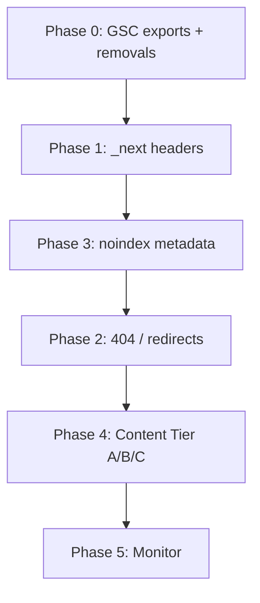

# SEO Coverage Fixes & Improvements

Plan for **nationalparksexplorerusa.com** based on Google Search Console Page indexing exports (May 24, 2026), live site checks, and the Next.js app in `next-frontend/`.

**Do not implement without explicit approval per phase.**

## Snapshot (May 17, 2026)

| Metric | Value |
|--------|------:|
| Indexed | 645 |
| Not indexed | 187 |
| Daily impressions | ~822 (peak ~1,374 May 9) |
| Live sitemap URLs | 569 |
| Non-critical: indexed though blocked by robots | 75 (`/_next/static/*`) |

**Positive trend:** May 4 indexed count jumped ~87 → ~548. Impressions grew sharply in parallel.

## Decisions (locked)

| # | Question | Decision |
|---|----------|----------|
| 1 | `/plan-ai/shared/[shareId]` indexing | **noindex, nofollow** (share via link only; not search landing pages) |
| 2 | Content scope | See [Content scope](#content-scope) below — pick a tier when starting Phase 4 |
| 3 | Plan document | Saved here: `docs/plans/seo-coverage-fixes-2026-05.md` |

## Content scope

**What it means:** How much **unique on-page copy** we add to park (and hub) pages to address **“Crawled – currently not indexed”** (111 URLs). Google already fetches these URLs but often skips indexing when pages look thin or templated (similar titles/descriptions across hundreds of `/parks/{slug}` pages).

**Not in scope for “content” phases:** robots headers, redirects, metadata, or GSC removals — those are technical (Phases 1–3).

### Tier options (choose one when starting Phase 4)

| Tier | Scope | Rough effort | Best for |
|------|--------|--------------|----------|
| **A — Focused** | Top **30** parks (by GSC impressions / Analytics) + state hub intros | 1–2 weeks copy + templates | Fast ROI; validate indexing lift before scaling |
| **B — Broad** | Top **100** parks + all **56** state hub pages | Several weeks | Balanced growth |
| **C — Full** | All **470+** park pages with unique blurbs | Months / content pipeline | Maximum coverage; needs editorial workflow |

**Recommendation:** Start with **Tier A**. If “crawled not indexed” drops for those URLs after 4–6 weeks, expand to Tier B.

**Per-page minimum (Tier A):**

- Unique meta description (not only NPS substring)
- 150–300 words unique intro (season, highlights, planning tip)
- JSON-LD (`TouristAttraction` or `Park`) where missing
- Internal links: state hub, 2–3 related parks, 1 relevant blog post if exists

## Goals

1. Remove `/_next/static/*` from Google’s index (~75 polluted URLs)
2. Resolve or redirect **27** 404 URLs (after GSC export)
3. Reduce **111 + 14** “not indexed after crawl/discover” via technical + content work
4. Harden private/utility routes with `noindex` + `robots.txt`
5. Sustain impression growth with cleaner index (~570 content URLs vs ~645 including junk)

## Phasing



---

## Phase 0 — GSC data & removals (no deploy)

**Status:** In progress — see [`docs/seo/phase-0/README.md`](../seo/phase-0/README.md)

**Owner:** Human (Search Console)  
**Effort:** ~30 min

### Actions

1. Export drilldown **Table.csv** for:
   - Not found (404) — 27
   - Page with redirect — 27
   - Crawled – currently not indexed — 111
   - Discovered – currently not indexed — 14
   - Excluded by `noindex` — 2
   - Alternate page with proper canonical — 1
2. **Removals** → prefix: `https://www.nationalparksexplorerusa.com/_next/static/`
3. After Phase 1 deploy → **Validate fix** on “Blocked by robots.txt” (validation currently **Failed**)

**Deliverable:** Spreadsheet mapping URL → action (redirect / fix link / content / ignore).

---

## Phase 1 — Technical index hygiene

**Status:** Implemented 2026-05-24 (`next.config.mjs` headers + `robots.ts`) — deploy to production, then GSC Validate fix + monitor `_next/static` issues.

**Priority:** Highest ROI  
**Files:** `next-frontend/next.config.mjs`, optionally `next-frontend/src/app/robots.ts`

### 1.1 `X-Robots-Tag` on static assets

Add to `next.config.mjs`:

```js
async headers() {
  return [
    {
      source: '/_next/static/:path*',
      headers: [
        { key: 'X-Robots-Tag', value: 'noindex, nofollow' },
      ],
    },
  ];
},
```

**Rationale:** `robots.txt` blocks fetch; headers prevent indexing of URLs already in the index. Addresses 75 “indexed though blocked” + 5 “blocked” (failed validation).

### 1.2 Optional robots.txt

In `robots.ts`, add explicit `Disallow: /_next/static/` (redundant but clear).

### Tests

- `curl -sI` sample chunk URL → `X-Robots-Tag: noindex, nofollow`
- GSC: validate “Blocked by robots.txt” after 1–2 weeks

### Success (2–4 weeks)

- “Indexed, though blocked by robots.txt” → 0
- Indexed count may drop ~75 (expected cleanup)

---

## Phase 2 — 404 & redirect audit

**Blocked by:** Phase 0 URL exports  
**Files:** `next-frontend/next.config.mjs`, internal links, sitemap

### 2.1 404s (27)

- Match export list to existing redirects in `next.config.mjs` (470+ park codes, legacy Vite routes, partial names).
- Add **301** only for URLs with impressions/backlinks.
- Fix internal links to canonical slugs.

### 2.2 Redirects (27)

Most are **intentional** (park codes, `/park/:slug`, `/plan` → `/plan-ai`, etc.). Do not remove.

- Update internal links and sitemap to **canonical URLs only** (full slugs).
- Confirm no redirect chains.

### 2.3 `/home` duplicate

**File:** `next-frontend/src/app/home/page.jsx`

Add permanent redirect `/home` → `/` unless product requires `/home` as a distinct page.

### 2.4 Sitemap source of truth

- Production serves Next `app/sitemap.ts` (~569 URLs).
- Confirm `server/src/routes/sitemap.js` is not exposed on www (avoid duplicate/conflicting sitemaps).

---

## Phase 3 — Metadata & robots hardening

**Status:** Implemented 2026-05-24 — deploy with Phase 1; verify `<meta name="robots">` on private routes after release.

**Files:** see table below; helper: `next-frontend/src/lib/seo.js`

### 3.1 Shared trip plans — noindex (decision #1)

**File:** `next-frontend/src/app/plan-ai/shared/[shareId]/page.jsx`

Change:

```js
robots: { index: true, follow: true },
```

To:

```js
robots: { index: false, follow: false },
```

Add `alternates.canonical` only if needed for OG; no search indexing.

### 3.2 Private / utility routes

Apply `metadata.robots: { index: false, follow: false }` (shared constant) on:

| Route | File |
|-------|------|
| `/login` | `app/login/page.jsx` |
| `/signup` | `app/signup/page.jsx` |
| `/forgot-password` | `app/forgot-password/page.jsx` |
| `/reset-password/[token]` | `app/reset-password/[token]/page.jsx` |
| `/profile` | `app/profile/page.jsx` |
| `/chat-history` | `app/chat-history/page.jsx` |
| `/offline` | `app/offline/page.jsx` |
| `/verify-email/[token]` | `app/verify-email/[token]/page.jsx` |
| `/admin`, `/admin/*` | admin pages (belt + suspenders with robots.txt) |

**Also add to `robots.ts` disallow:**

- `/chat-history`
- `/offline`
- `/verify-email`
- `/plan-ai/shared/` (prefix disallow for shared trips)

Review private trip routes under `/plan-ai/[tripId]/*` — default **noindex** unless explicitly public.

### 3.3 Root layout default

**File:** `next-frontend/src/app/layout.js`

Add explicit `robots: { index: true, follow: true }` on root metadata for indexable site default.

### 3.4 Legacy `SEO.jsx` (improvement backlog)

**File:** `next-frontend/src/components/common/SEO.jsx`

Migrate remaining Helmet usage to Next Metadata API over time to avoid conflicting robots/canonical signals.

---

## Phase 4 — Content & internal linking

**Status:** Tier A scaffolding implemented 2026-05-24 — unique meta + overview intros (30 parks), blog→park banners, breadcrumbs JSON-LD, state hub links. Deploy and monitor GSC.

**Blocked by:** Phase 0 “crawled not indexed” export for URL-level triage (optional refinement)

### 4.1 Triage (from export)

| Tier | Action |
|------|--------|
| A | High-value parks/blog → content + links + optional URL inspection request |
| B | Thin templates → expand copy per content tier |
| C | Duplicate of indexed URL → canonical/links only |

### 4.2 Park pages

**File:** `next-frontend/src/app/parks/[parkCode]/page.jsx`

- Unique meta descriptions (template + park-specific fields)
- Unique intro copy per tier scope
- JSON-LD structured data on server component
- Internal links: state hub, related parks, blog

### 4.3 Hubs

**Files:** `app/parks/state/[stateCode]/page.jsx`, `app/blog/category/[category]/page.jsx`

Unique hub intros; link to all child URLs in sitemap.

### 4.4 Internal linking

Homepage, `/explore`, blog → under-linked Tier A parks.

### 4.5 Sitemap

**File:** `next-frontend/src/app/sitemap.ts`

Use real `lastModified` when content changes; avoid identical dates for all 470 parks.

---

## Phase 5 — Monitoring

**Weekly (4 weeks post Phase 1):**

| Check | Source |
|-------|--------|
| Indexed / not indexed | GSC Pages |
| `_next/static` issues | GSC drilldown |
| 404 count | GSC |
| Impressions / clicks | GSC Performance |
| Sitemap health | GSC Sitemaps |

**Done (8-week target):**

- [ ] Indexed though blocked by robots = 0
- [ ] 404s < 5 or all explained
- [ ] Tier A URLs: “crawled not indexed” reduced 30%+
- [ ] Indexed ≈ sitemap content URLs (~570), excluding assets

---

## Implementation units (for PRs)

| PR | Phase | Scope |
|----|-------|--------|
| PR1 | 1 + 3 (partial) | `next.config.mjs` headers; `robots.ts`; shared trip noindex; auth/chat-history noindex |
| PR2 | 2 | Redirects from 404 export; `/home` redirect |
| PR3 | 3 | Remaining noindex layouts; root metadata robots |
| PR4+ | 4 | Content Tier A (30 parks) — batchable |

---

## Issue traceability (GSC → phase)

| GSC issue | Pages | Phase |
|-----------|------:|-------|
| Indexed, though blocked by robots.txt | 75 | 0, 1 |
| Blocked by robots.txt | 5 | 1 |
| Not found (404) | 27 | 0, 2 |
| Page with redirect | 27 | 2 |
| Excluded by noindex | 2 | 0, 3 |
| Alternate page with proper canonical | 1 | 0, 3 |
| Crawled – currently not indexed | 111 | 0, 4 |
| Discovered – currently not indexed | 14 | 0, 4 |

---

## References

- GSC exports (repo root): `https___www.nationalparksexplorerusa.com_-Coverage-2026-05-24.zip`, drilldown zips
- Robots: `next-frontend/src/app/robots.ts`
- Sitemap: `next-frontend/src/app/sitemap.ts`
- Redirects: `next-frontend/next.config.mjs`
